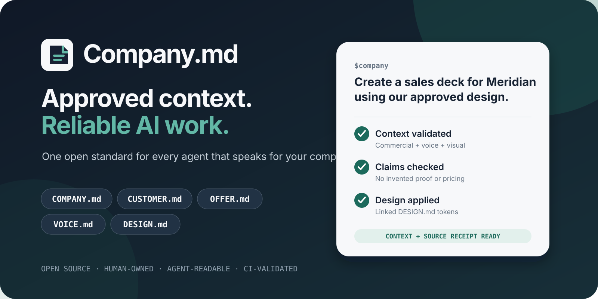

<p align="center">
  
</p>

# Company.md

[](https://github.com/dilanhendadura/company.md/actions/workflows/ci.yml)
[](https://github.com/dilanhendadura/company.md/actions/workflows/codeql.yml)
[](LICENSE)
[](package.json)

**The open context standard for company-aware AI.** Give every agent the same approved company, customer, offer, voice, and design context—without pasting it into every prompt.

```text
$company create a sales deck for Meridian using our approved design
```

The agent loads only the context needed, checks claims and commercial boundaries, uses the linked visual system, creates the artifact, and leaves a source receipt. The files stay plain Markdown: business teams can own them, legal can review them, Git can version them, and any coding agent can read them.

Company.md was sparked by [this tweet by Corey Ganim](https://x.com/coreyganim/status/2091196448364974090?s=46) about the four context files every useful AI workspace needs.

## Development candidate: 0.4.0

The current checkout adds multi-company/product routing and stricter presentation evidence. This candidate has not been published to npm or tagged as a GitHub release by the local validation run. Build and test it locally with `npm ci`, `npm run check`, and `npm run test:package`. Use `node dist/cli.js` or install the locally packed tarball; a plugin runner can use `COMPANYMD_CLI=/absolute/path/to/dist/cli.js` until the matching release exists.

A portfolio can declare `companymd.yaml` and run:

```bash
companymd context ./company-context --subject product-a --artifact presentation --compact --output context.md --receipt context.json
```

The selected subject determines business context, design and an optional template skill. Context is validated once from the same snapshot; ambiguous subjects, scope conflicts and missing required design fail explicitly. [Enterprise routing](docs/enterprise-adoption.md) explains groups, companies, products, paths and migration. [Compatibility](docs/compatibility.md) distinguishes portable adapters from real agent tests.

## Published installation workflow

Create a governed starter pack directly from GitHub:

```bash
npx --yes --package=github:dilanhendadura/company.md companymd init ./company-context \
  --name "Acme Corporation" \
  --owner "Corporate Strategy" \
  --contact "strategy@example.com" \
  --with-design
```

Then open that workspace in Codex and install the repository-scoped skill:

```bash
npx --yes --package=github:dilanhendadura/company.md companymd install ./company-context --agent codex
```

Run `/skills` and select **Company.md**, or invoke it directly:

```text
$company interview me and complete our Company.md drafts
$company create a sales deck for this customer using our approved design
$company review this proposal against our offer and claims policy
```

The initializer creates drafts, not fake certainty. The skill interviews the owners, records unknowns, and keeps the files in `draft` until the named humans approve them.

### Install as a Codex plugin

The plugin packages the skill and its guided prompts for reuse across workspaces:

```bash
codex plugin marketplace add dilanhendadura/company.md
codex plugin add company-md@company-md
```

The npm release will shorten the CLI commands to `npx company.md ...`; until it is published, the GitHub commands above are the reproducible path.

## The standard

```text
COMPANY.md  ─┬─ CUSTOMER.md
             ├─ OFFER.md
             ├─ VOICE.md
             └─ DESIGN.md  optional; validated with @google/design.md
```

| File | The question it answers | Minimum useful content |
| --- | --- | --- |
| `COMPANY.md` | Who are we? | What the company sells, serves, earns from, believes, differentiates, and will not do |
| `CUSTOMER.md` | Who are we for? | ICP, pains, objections, triggers, questions, language, fears, criteria, and exclusions |
| `OFFER.md` | What can we promise? | Packages, deliverables, pricing logic, proof, promises, prohibited claims, fit, and guardrails |
| `VOICE.md` | How do we communicate? | Voice behavior, anti-patterns, phrases, mechanics, channel adaptations, and examples |
| `DESIGN.md` | How should it look and behave? | Visual rationale, tokens, components, density, and prohibitions |

Company.md owns business meaning and verbal constraints. The optional `DESIGN.md` owns visual decisions and is checked with Google's official linter. Structured front matter gives agents exact metadata; Markdown prose preserves the intent humans need to review.

## Why teams use it

| Without Company.md | With Company.md |
| --- | --- |
| Brand and offer context is pasted into every prompt | One reviewed source is loaded on demand |
| Different agents invent different answers | Every agent sees the same scoped truth |
| Drafts, assumptions, and approved claims look identical | Status, evidence, owner, and confidence are explicit |
| A deck can be on-brand but commercially wrong | Business constraints are applied before visual rules |
| Nobody can reconstruct which context produced a file | Receipts record sources and verifiable SHA-256 hashes |
| Context quietly grows stale | Owners and review dates are linted in CI |

This is a context contract, not an access-control system. Real repository and document permissions must match the declared classification. Never store credentials, raw personal data, or unrestricted confidential material in a pack.

## How agents use it

```text
plain-language request
        │
        ▼
resolve subject + validate selected sources
        │
        ▼
load the narrowest profile
core → customer → commercial → communications → visual
        │
        ▼
create or review the deliverable
        │
        ▼
claims check + source receipt + human approval gate
```

Company.md follows the successful patterns behind [`AGENTS.md`](https://agents.md/), `CLAUDE.md`, and `GEMINI.md`: plain files, directory scope, progressive disclosure, and version control. It complements those instruction files instead of replacing them:

| Standard | Primary job |
| --- | --- |
| `AGENTS.md` / `CLAUDE.md` / `GEMINI.md` | Tell an agent how to work in a repository |
| `llms.txt` | Help a model discover useful website content |
| `DESIGN.md` | Preserve visual intent and implementation rules |
| **Company.md** | Define what the business may say, sell, promise, and represent |

See [Compatibility](docs/compatibility.md) for the boundaries and integration patterns.

## CLI

Requirements: Node.js 20 or newer.

```text
companymd init [directory] --name <name> [--with-design]
companymd create <public-url> [directory] [--mode starter|team|enterprise]
companymd adopt [directory] [--format json|pretty]
companymd install [directory] [--agent codex|claude|cursor|copilot]
companymd lint [path|-] [--format json|pretty] [--strict]
companymd resolve [path] [--subject <id>] [--artifact presentation]
companymd context [path] [--subject <id>] [--profile <profile>] [--clearance <level>] [--receipt <file>]
companymd diff <before> <after>
companymd eval [path] --baseline <file> --candidate <file> [--rubric <yaml>]
companymd artifact verify <receipt.json> [--root <directory>] [--format json|pretty]
companymd spec
companymd schema [frontmatter|artifact-receipt]
```

Useful workflows:

```bash
# Seed low-confidence drafts from a public homepage
companymd create https://acme.example ./company-context --with-design

# Inventory existing sources without rewriting them
companymd adopt ./existing-workspace --format pretty

# Validate for CI; warnings fail too
companymd lint ./company-context --strict

# Recompute every recorded hash and enforce artifact-specific completion gates
companymd artifact verify ./deck.pptx.companymd-receipt.json --root . --format pretty

# Native cloud artifacts use their HTTPS URL, provider, and immutable revision id
# in the receipt; remote access and revision checks are mandatory gates.

# Give an agent only the context required for visual work
companymd context ./company-context \
  --profile visual \
  --clearance internal \
  --output .company-context.md \
  --receipt .company-context.receipt.json
```

Profiles are cumulative: `core`, `customer`, `commercial`, `communications`, `visual`, and `all`. Context generation refuses invalid, deprecated, over-classified, or draft sources by default. During authoring, use `--allow-draft` deliberately.

`starter` keeps incomplete authoring guidance informational; `team` turns collaboration gaps into warnings; `enterprise` requires durable escalation contacts for strict CI. `lint` emits JSON by default and returns exit code `1` for errors. `diff` reports semantic changes and fails when validation regresses. `eval` measures explicit conformance criteria without pretending to produce a universal truth score.

## Proof, not a demo claim

The checked-in [sales-deck evaluation](evals/sales-deck/SCENARIO.md) compares a no-context baseline with a Company.md-guided candidate for a fictional enterprise buyer.

| Gate | Current result |
| --- | --- |
| Business + DESIGN.md validation | Pass: 0 errors, 0 warnings |
| Textual conformance rubric | Pass: every baseline failure fixed, 0 regressions |
| Source and artifact traceability | Pass: portable file hashes plus versioned native-cloud artifacts and machine-readable gates |
| Package install and CLI workflow | Pass: both binaries in a clean environment |
| Public Codex plugin and `$company` routing | Pass: isolated install selected the packaged skill and enforced a prohibited claim |
| PowerPoint export and rendered-slide QA | Open gate: presentation runtime unavailable in the recorded run |

Read the exact [sales-deck result and limitation](evals/sales-deck/RESULT.md) and the [public plugin smoke result](evals/plugin-smoke/RESULT.md). Company.md does not call deck generation production-ready until the `.pptx` is exported, rendered, and inspected. That visible failure boundary is intentional: trustworthy context infrastructure should show what it has not proved.

## Enterprise rollout

Start with one high-frequency artifact and one accountable business owner. Do not begin by documenting the whole company.

1. **Pilot:** create the four-file minimum for one offer and one ICP.
2. **Prove:** compare the same task with and without the pack using an explicit rubric.
3. **Govern:** add owners, classification, review dates, claim evidence, and CODEOWNERS.
4. **Scale:** add scoped overlays by business unit, product, region, or locale.
5. **Enforce:** lint active packs and inspect semantic diffs in CI.

The [authoring playbook](docs/authoring-playbook.md) is written for coding agents interviewing non-technical owners. The [enterprise adoption guide](docs/enterprise-adoption.md) covers scope, approvals, classification, and rollout. [GOVERNANCE.md](GOVERNANCE.md) explains how the open standard itself evolves.

## Quality and security

Every change is checked on Node.js 20 and 24. Release gates include coverage thresholds, clean-package installation, Linux/macOS/Windows smoke tests, dependency review, production dependency audit, CodeQL, plugin validation, skill validation, and npm provenance-ready publishing.

```bash
npm install
npm run check
npm run test:coverage
npm run test:package
```

Classification labels are metadata, not enforcement. Review [SECURITY.md](SECURITY.md) before using Company.md with enterprise context.

## Status and roadmap

The CLI is at `0.3`; the compatible context format remains `companymd/context/v1`. Unknown metadata keys and extra Markdown sections are preserved so organizations can extend the format without waiting for `1.0`.

The public [roadmap](ROADMAP.md) prioritizes evidence-backed interoperability, real artifact evals, and migration safety. The [launch kit](docs/launch-kit.md) contains a transparent demo script and ready-to-adapt launch copy.

## Inspiration and relationship to DESIGN.md

Company.md adopts the useful pattern demonstrated by [Google Labs' DESIGN.md](https://github.com/google-labs-code/design.md): machine-readable front matter for exact values, Markdown prose for intent, a JSON-first linter, semantic diffs, and context that persists across agents. Company.md is an independent project focused on enterprise business context; it uses `@google/design.md` only when validating a linked visual system.

## Contributing

Read [CONTRIBUTING.md](CONTRIBUTING.md) before proposing a schema or behavior change. Use [GitHub Discussions](https://github.com/dilanhendadura/company.md/discussions) for adoption patterns and open questions; use issues for reproducible failures and format proposals.

If this solves a context problem your team keeps repeating, try the pilot and share the result—successful or not. That evidence is more valuable than another abstract feature request.

Released under the [Apache License 2.0](LICENSE).
